# [Music Visualizer](https://youtu.be/ePKxjf9t\_z8)

# Design Document

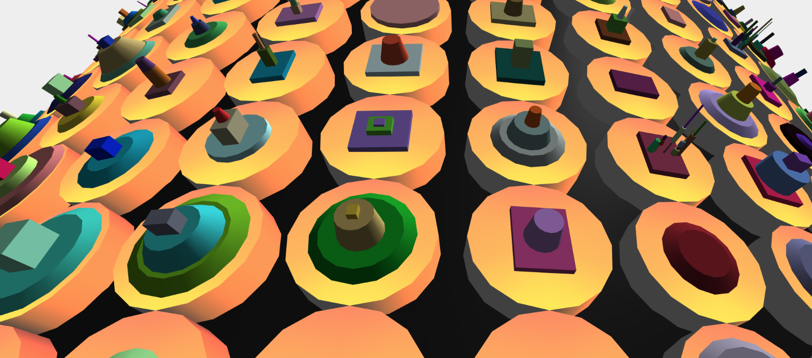

# Introduction
My Music Visualizer is a procedurally generated speaker that shows interesting graphics tuned to a music track. With different camera views, varied colors and shape grammar iterations, the visualizer makes music more dynamic.

# Goal
My goal is to produce a demo choreographed to a music track to show various visual elements I have added to make the visualizer appealing.

# Inspiration / Reference
I was inspired by the JBL Pulse 2, a portable speaker that visualizes the sound it plays with interactive lights. It has a cylindrical body and lights all around the surface that light up in different colors to while playing music.

I wanted my visualizer to have a similar feel, but at the same time, achieve a look that is hard to replicate in real life. So, I wanted to use shape grammar to produce interesting shapes that will be laid out in place of the lights and iterate them based on music.

# Specification
The main features of my project are as follows –

- Shape Grammar (randomly colored and sized shapes laid on top of one another in interesting placements)
- Music-dependent changes (changing colors, bulging speaker, iterating shapes)
- Camera movement (rotation, zoom)

# Techniques
The main technical tools I use are as follows –

- Shape Grammar / L-Systems
- Sound Analysis
- Noise Shader

# Design
Here is a diagram of how I planned to design my visualizer.

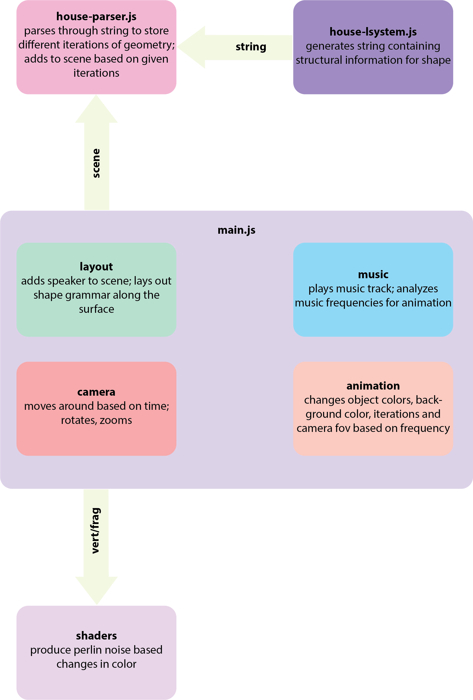

# Timeline 
**Week 1**
- Design shape grammar
- Design speaker
- Layout shape grammar onto the speaker

**Milestone**
Submit working shape grammar laid out on speaker.

**Week 2**
- Allow for live iterations in shape grammar
- Write shader
- Add sound based features – color changes, iterations
- Add camera movement

**Final Milestone**
Submit fully working visualizer.

# Results
**Shape Grammar**

I designed shape grammar such that it starts with a &quot;level&quot; (can be either box of dimensions greater than half of or equal to given radius or cylinder of bottom radius greater than half of or equal to given radius and top radius greater than half of or equal to bottom radius, of random color) and a variable that changes in next iteration to either place the next level in the center on top of the last one, choose between placing two, three, four or eight smaller subdivisions in random positions on the last level, or both. I then also saved my objects so that iteration changes don&#39;t change the shape, color and size.

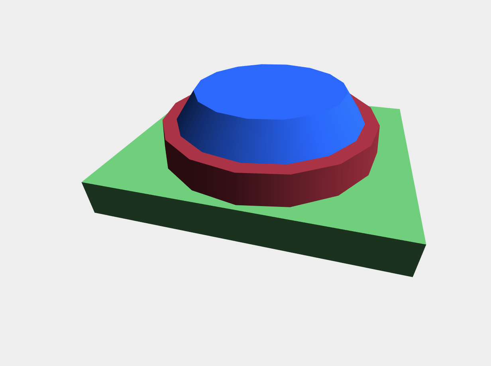 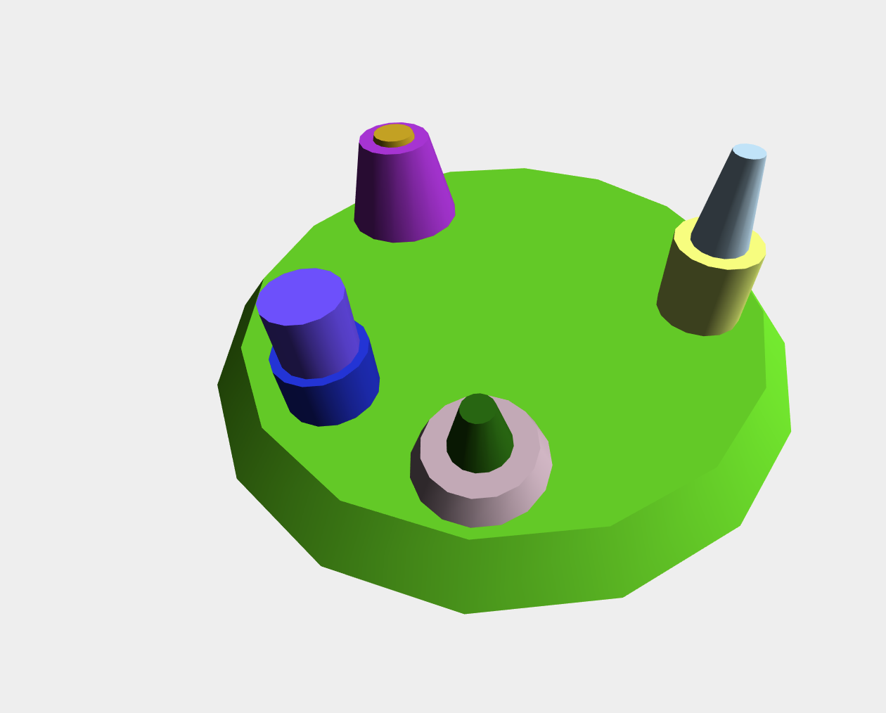 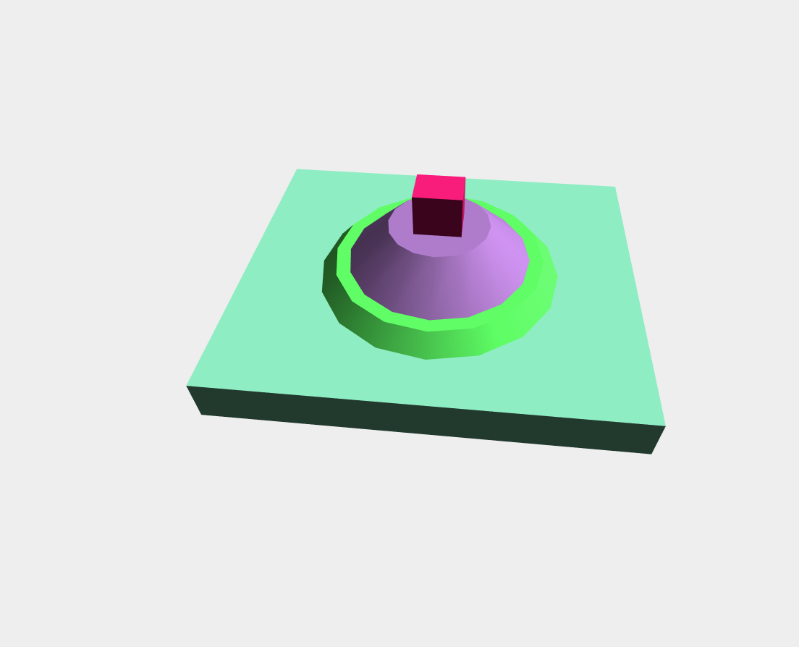
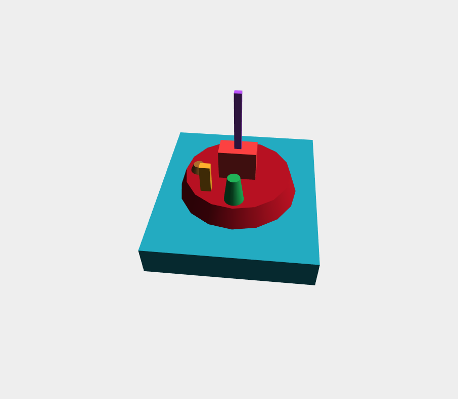 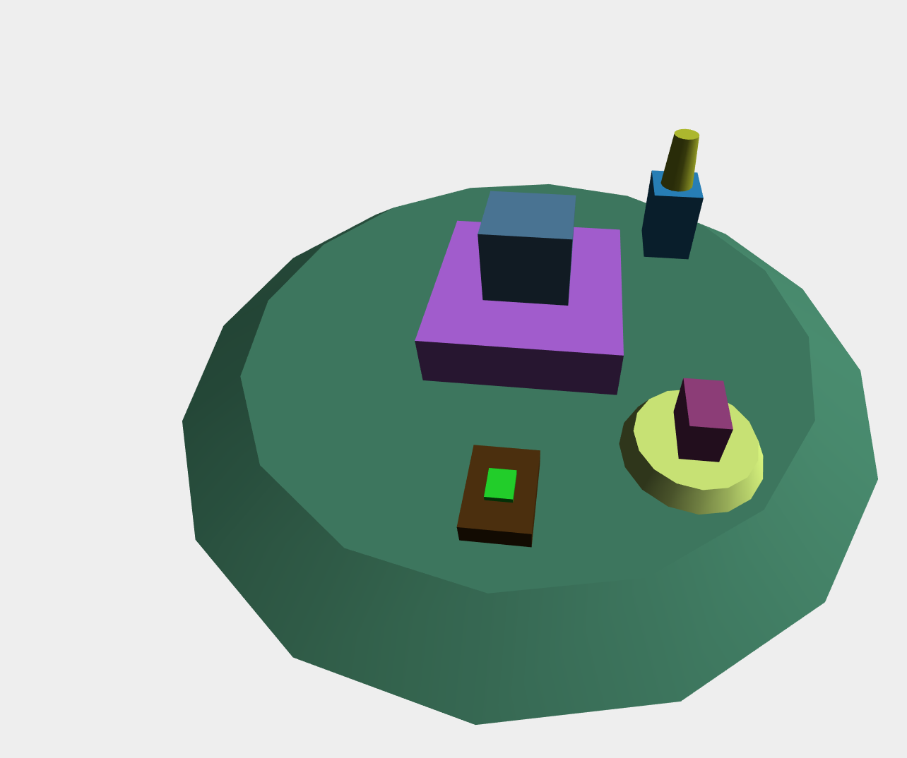 

**Music dependent features**

The music dependent features on my visualizer include a shader that changes the color of the cylinders laid out on the speaker based on perlin noise using a color palette, background that changes using a cosine based palette, an increase or decrease in the camera fov to give a bulging effect and iterations in the shape grammar. All of these take in the average frequency at current time of the music file.

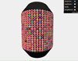 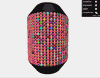 
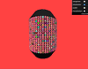 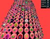

**Camera Animation**

The camera movement is hard-coded to showcase all the features of my visualizer. These movements include rotation along the xz plane in different radii and and zoomed in rotation to show the shape grammar develop.
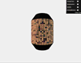 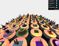 

# Evaluation
My speaker turned out to be mostly what I expected. I was able to achieve the look and feel that I wanted from the visualizer.

However, there were some changes I had to make along the way.
- Shaders – I had first planned to write shaders for the background and the bulging as well, but just modifying the colors and camera fov worked perfectly fine and saved a lot of time.
- Camera movement – Camera movement was an addition I hadn&#39;t initially thought of making, but realized that it looks a lot better with it than without.
- Iterations – At first my iterations looked very different because I wasn&#39;t storing my geometries. Every time the frequency changed, my shapes looked entirely different, defeating the purpose of making them music-dependent. So, I ended up storing the geometries during initialization and adding or removing them from the scene when the number of iterations was changed.

Unfortunately, I wasn't able to make gifs along the way for these changes.

# Future work
Given more time, I would like to write more shaders to modify the background and the general look of my speaker. I would also like too allow for an option to play your own song. Moreover, I would try to animate the the increase and decrease in iterations in some way.

# Acknowledgements
My project was in large part suggested by Rachel. She suggested that I lay out my shape grammar on a cylinder and choreograph the iterations based on music.
I used noise functions from the class lecture slides for my shader.
For the current track, I used music from [DVBBS &amp; CMC$ - Not Going Home (Mesto Remix)](https://www.youtube.com/watch?v=t75oPQubFI4&amp;index=1&amp;list=PL3lkWEnhkNuYlklz1XVhctuHs7050dSNT).
I also used [Inigo Quilez&#39; color palette function](http://iquilezles.org/www/articles/palettes/palettes.htm) to change background color based on frequency.

# Demo
You can watch a demo of my project on YouTube - [https://youtu.be/ePKxjf9t\_z8](https://youtu.be/ePKxjf9t_z8).